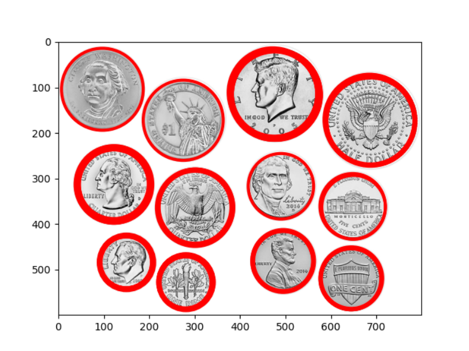

# convolution Edge detection
this exercise is about the concept of the convolution and edge
detection by performing simple manipulations on images.
This exercise covers:  
• Implementing convolution on 1D and 2D arrays  
You can read here : [Convolution](https://en.wikipedia.org/wiki/Convolution "Wikipedia")  

• Performing image derivative and image blurring  
• Edge detection  
Identification edge by taking the 8 Neighbors for each pixel and find a zero crossing like :{+,0,-} / {+,-}  

• Hough Circles  
Identification circles on given image with Accumulator Matrix- you can read here : [Circle_Hough_Transform](https://en.wikipedia.org/wiki/Circle_Hough_Transform "Wikipedia")

• Bilateral filter  
 smoothening a given image and reducing noise, while preserving edges   

